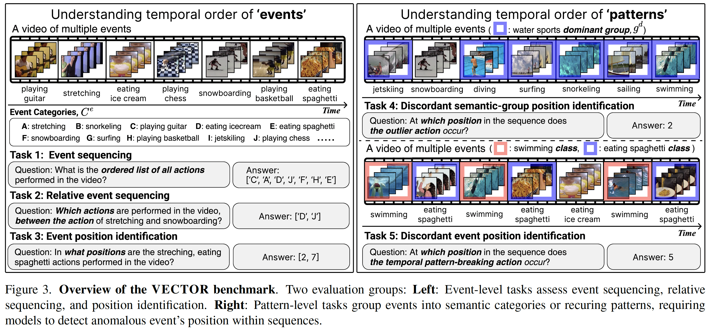
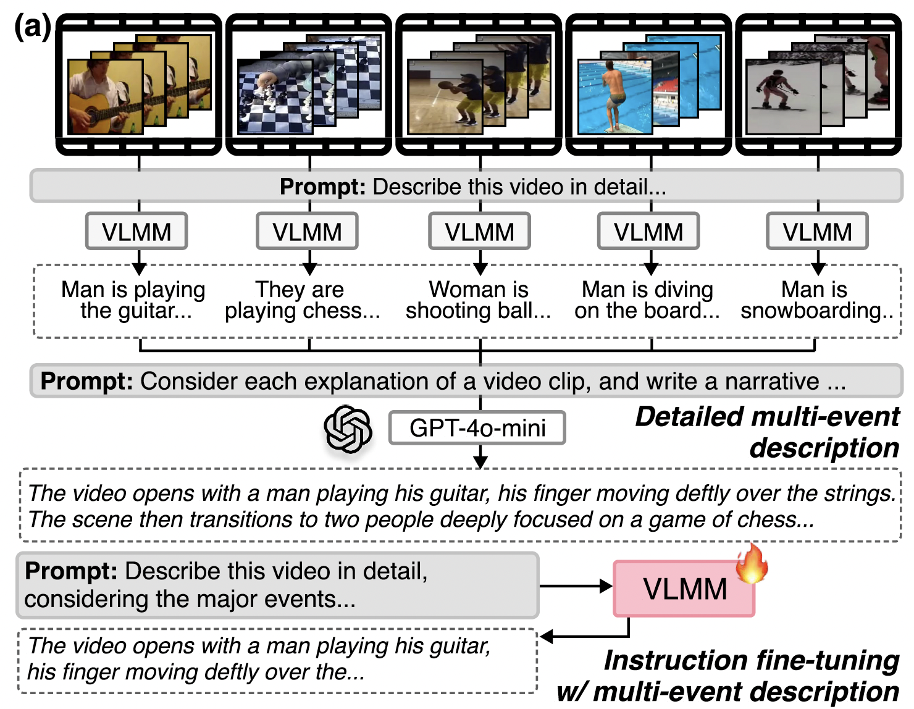
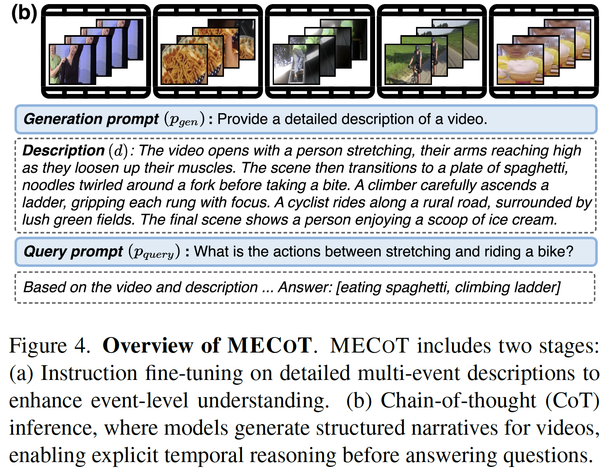

# VECTOR: What Happens When (WACV 2026)

Official implementation of **"What Happens When: Learning Temporal Orders of Events in Videos"** (WACV 2026).

[`Daechul Ahn`](https://dcahn12.github.io/)\* | [`Yura Choi`](https://yuuraa.github.io)\* | [`Hyeonbeom Choi`](https://hyeonbeomchoi.github.io)\* | [`Seongwon Cho`](https://seongwon980.github.io/) | [`San Kim`](https://mounKim.github.io/) | [`Jonghyun Choi`](https://ppolon.github.io/)†

<sub><span style="color:gray">\* Equal contribution &nbsp;&nbsp; † Corresponding author</span></sub>

[[Paper]](https://arxiv.org/abs/2512.08979) [[Project Page]](https://dcahn12.github.io/VECTOR)

### Overview of VECTOR Benchmark

<p align="center">
  
</p>

### Overview of MECoT

<table>
  <tr>
    <td></td>
    <td></td>
  </tr>
</table>

## Setup

### Environment

```bash
docker pull hyeonbeomchoi/vector
```

### Dataset (Kinetics-700)

```bash
cd kinetics-dataset
bash k700_2020_downloader.sh
bash k700_2020_extractor.sh
```

> **Note:** We synthesize the VECTOR benchmark from Kinetics-700_2020 validation videos. You can find task-specific JSONL files under `kinetics-dataset/kinetics_jsonl/`.

### Model Checkpoints

```bash
# LLaVA-OneVision (baseline)
huggingface-cli download lmms-lab/llava-onevision-qwen2-7b-ov \
  --local-dir checkpoints/llava-onevision-qwen2-7b-ov

# LLaVA-OneVision finetuned on detailed multi-event descriptions (ours)
huggingface-cli download SNUMPR/llava-onevision-qwen2-7b-ov-multi-event \
  --local-dir checkpoints/llava-onevision-qwen2-7b-ov-multi-event
```

## Evaluation

Single GPU (VRAM >40GB) is enough to run inference. Multiple GPUs can be specified (comma-separated) for faster parallel inference.

### LLaVA-OneVision (baseline, 1-step)

```bash
bash scripts/run_pipeline.sh --gpus [GPU_IDS] --task_id [1-5] --level [1|2]
# e.g., bash scripts/run_pipeline.sh --gpus 0 --task_id 1 --level 1
```

### MECoT (ours, 2-step)

```bash
bash scripts/run_pipeline.sh --gpus [GPU_IDS] --task_id [1-5] --level [1|2] --mecot
# e.g., bash scripts/run_pipeline.sh --gpus 0,1,2,3 --task_id 2 --level 2 --mecot
```

### All Tasks

```bash
# LLaVA-OneVision (default)
for TASK in 1 2 3 4 5; do
  for LEVEL in 1 2; do
    bash scripts/run_pipeline.sh --gpus 0,1,2,3 --task_id $TASK --level $LEVEL
  done
done

# MECoT
for TASK in 1 2 3 4 5; do
  for LEVEL in 1 2; do
    bash scripts/run_pipeline.sh --gpus 0,1,2,3 --task_id $TASK --level $LEVEL --mecot
  done
done
```

| Task | Description | Levels |
|------|------------|--------|
| 1 | Event Sequencing  | L1: 4 clips, L2: 8 clips |
| 2 | Relative Event Sequencing | L1: 4 clips, L2: 8 clips |
| 3 | Event Position Identification (single/double/triple) | L1: 4 clips, L2: 8 clips |
| 4 | Discordant Semantic Group Position Identification | L1: 4 clips, L2: 8 clips |
| 5 | Discordant Event Position Identification | L1: ABABAB+ABCABC<br>L2: ABABABAB+ABCABCABC |

Results are saved under `results/<checkpoint_name>/`.

## Citation

```bibtex
@inproceedings{ahn2026whathappenswhen,
  title={What Happens When: Learning Temporal Orders of Events in Videos},
  author={Daechul Ahn and Yura Choi and Hyeonbeom Choi and Seongwon Cho and San Kim and Jonghyun Choi},
  booktitle = {WACV},
  year={2026}
}
```
